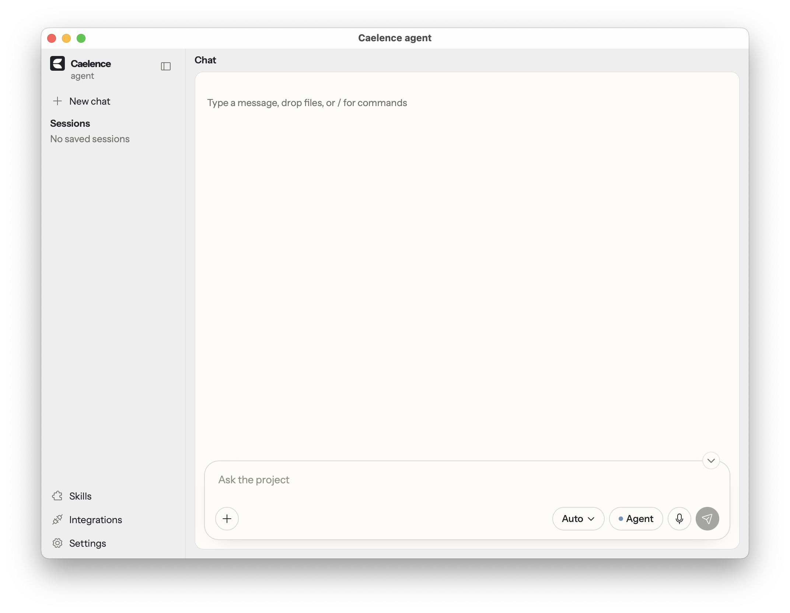
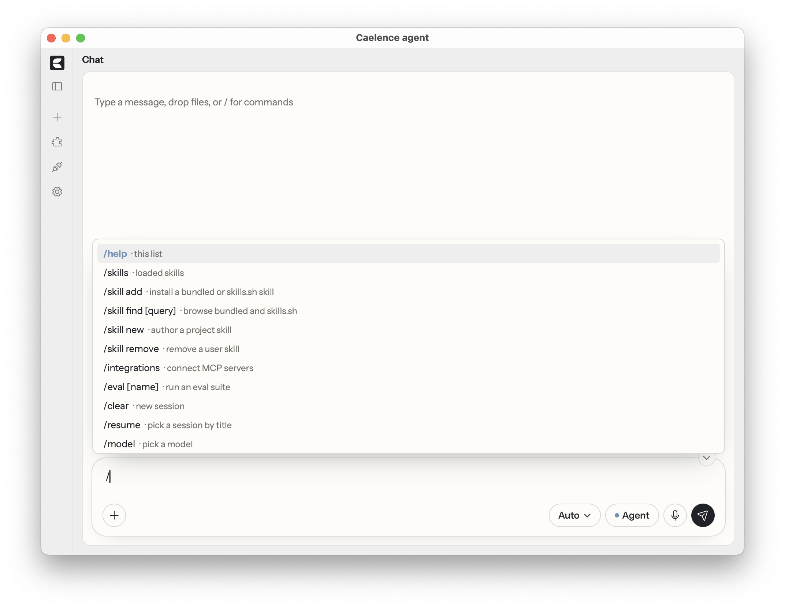
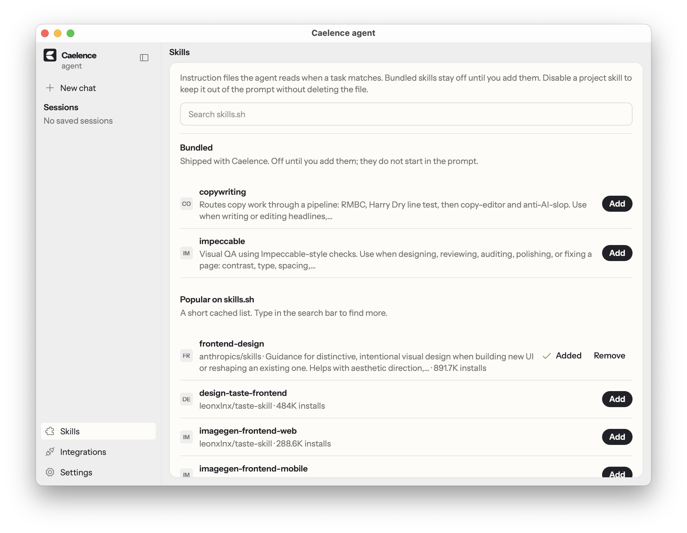
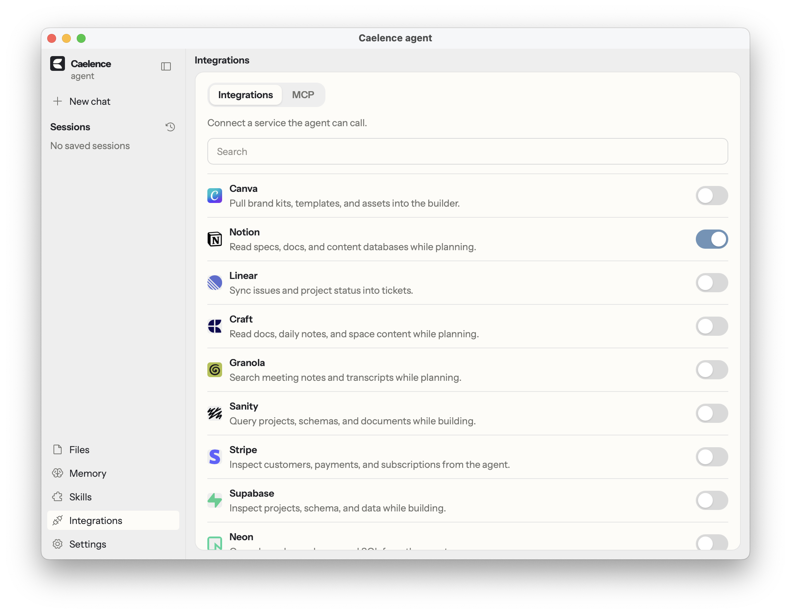

<p align="center">
	
</p>

# Caelence agent

A harness with a desktop app and a terminal UI for OpenRouter models, skills, and integrations.

The package is [`@useavalon/caelence-agent`](https://www.npmjs.com/package/@useavalon/caelence-agent) on npm and needs [Bun](https://bun.sh) 1.2 or later.

## Install

```bash
bunx --bun @useavalon/caelence-agent desktop
```

That starts the desktop app, and you paste an OpenRouter key in Settings. The window build needs [Rust](https://rustup.rs) on the machine.

<p align="center">
	
</p>

For the terminal UI:

```bash
export OPENROUTER_API_KEY=…
bunx --bun @useavalon/caelence-agent
```

`bun add -g @useavalon/caelence-agent` installs the short names `caelence` and `caelence desktop`. Those only work when Bun already put `~/.bun/bin` on PATH. Homebrew usually does not, which is why this README starts with `bunx`. `caelence-agent` and `harness` are the same command. Run it from a git repository and that repo is the project; otherwise files are kept under `~/.harness/workspace`. `--cwd` overrides both.

## Config

You can run with no config file, in which case the defaults below apply. To change them, add `harness.config.ts` at the project root:

```ts
import type { HarnessConfig } from "@useavalon/caelence-agent";

export default {
	name: "my-agent",
	model: "openrouter/auto",
	instructionsFile: "AGENTS.md",
	skillsDir: "skills",
	evalsDir: "evals",
	theme: "caelence",
	mode: "agent",
	tools: { exec: { approval: "prompt" } },
	mcp: [],
} satisfies HarnessConfig;
```

| File | Role |
|------|------|
| `harness.config.ts` | Name, model, mode, skills, evals, theme, approvals |
| `skills/**/SKILL.md` | Skills the agent can load |
| `evals/<suite>/eval.ts` | Eval suites |
| `AGENTS.md` | Project instructions |
| `~/.harness/AGENTS.md` | User instructions for every project |
| `.harness/sessions/` | Session logs |
| `~/.harness/integrations.json` | Connected hosted MCP servers |

The desktop stores the OpenRouter key in `~/.harness`. The terminal UI reads `OPENROUTER_API_KEY`, and optionally `OPENROUTER_MODEL` and `OPENROUTER_BASE_URL`.

## Commands

```
caelence desktop              Desktop window (needs Rust)
caelence                      Terminal UI
caelence chat -m "…"          One turn, then exit (no TUI)
caelence --mode plan          Start the TUI in plan mode
caelence eval [name]          Run an eval suite, or list suites
caelence experiment           Local website-generation regression (no Langfuse)
caelence init                 Add .harness/ to .gitignore
caelence skill find [query]   Bundled skills and popular skills.sh
caelence skill add <src>      Install into ~/.harness/skills
caelence skill remove <name>  Uninstall a user skill, or disable a project skill
caelence help                 This list
```

Flags: `--mode ask|plan|agent`, `--cwd <path>`, `-m` / `--message <text>`.

`caelence chat -m` is the non-interactive path for scripts and CI: it sends one message, prints the reply and any tool lines, then exits without opening the desktop or the terminal UI. `--mode` still applies, and if stdin is not a TTY, tool approval is deny.

`caelence init` only appends `.harness/` to `.gitignore` so session logs are not committed. If you want a starter host project, `caelence init --examples` writes a sample `harness.config.ts`, `AGENTS.md`, a skill, and an eval, with `--name` setting the config name.

In the desktop and the terminal UI, `/` opens slash commands, and Tab completes them in the terminal.

<p align="center">
	
</p>

```
/help              this list
/skills            loaded skills
/skill find [q]    browse bundled and skills.sh
/skill add         install a bundled or skills.sh skill
/skill new         author a project skill
/skill remove      remove a user skill
/integrations      connect MCP servers
/eval [name]       run an eval suite
/clear             new session
/resume            pick a session by title
/model             pick a model
/mode              ask, plan, or agent
/compact           summarize earlier turns
/image [prompt]    generate an image
/video [prompt]    generate a clip
/transcribe        speech to text model
/settings          OpenRouter API key
/exit              quit
```

`/skill add --project` installs into the project's `skillsDir` rather than the user store. `/skill new` takes a name and a short brief and authors a project skill from that.

## Skills

A skill is a `SKILL.md` file whose YAML front matter has `name` and `description`. Anything you add from the catalog is copied into `~/.harness/skills`; skills that already live in the current project load as well, and the project copy wins when the names collide.

The package also ships a catalog of bundled skills and popular listings from skills.sh, but those are not injected into the prompt until you add them. Once added they behave like any other skill. Existing `skills/`, `.cursor/skills`, and `.claude/skills` folders in the repo are picked up automatically. If you want a project skill on disk but out of the prompt, disable it from `/skill find` instead of deleting the file.

<p align="center">
	
</p>

| Add | What you get |
|------|------|
| `copywriting` | One writing pipeline: RMBC, Harry Dry, then copy-editor. No invented metrics or testimonials. |
| `impeccable` | Visual QA against the host `design.md` (Apache 2.0 adaptation) |

## Integrations

Hosted MCP servers show up as extra tools the agent can call. You connect them from the desktop sidebar or with `/integrations` in the terminal; the browser handles sign-in, and the tools are available on the following turn.

<p align="center">
	
</p>

| Connect | Needs |
|------|------|
| Hosted server | Browser sign-in |
| Google or Microsoft | Desktop OAuth client in Settings |
| Figma | Dev Mode MCP in Figma desktop |

Most catalog servers only need that browser sign-in. Google Workspace and Microsoft 365 need a desktop OAuth client pasted in Settings first, and Figma talks to the Dev Mode MCP server running in Figma desktop.

Each connection is stored in `~/.harness/integrations.json`, and disconnecting removes that row. Local stdio servers are configured separately through `mcp` in `harness.config.ts` (`command`, `args`, `env`).

## Modes

| Mode | Tools |
|------|------|
| `ask` | Read, search, git status / diff / log |
| `plan` | Ask plus `todo_write` |
| `agent` | Writes, `exec`, `git_commit`, and `task` |

Start in `ask`, `plan`, or `agent` with `/mode`, which changes which tools are available. `exec` and `git_commit` prompt for approval by default (`prompt`), and `auto` still refuses destructive commands. Local exec is the host machine rather than a sandbox.

## Library

The desktop, the terminal UI, and `caelence chat -m` all call `createHarness`, so you can drive the same runtime from a bot, a script, or another host UI.

```bash
bun add @useavalon/caelence-agent
```

```ts
import { createHarness } from "@useavalon/caelence-agent";

const harness = await createHarness({ cwd: process.cwd() });
await harness.runTurn("fix the failing test", (event) => {
	if (event.kind === "text_delta") process.stdout.write(event.text);
	if (event.kind === "tool_call_start") process.stderr.write(`› ${event.toolName}\n`);
});
harness.close();
```

`runTurn` streams `AgentEvent`s (text, tools, usage, errors) while it writes the session under `.harness/sessions`. Optional arguments include `config`, `mode`, `provider`, `extraTools`, `approvalPolicy`, and `observability`: pass a fake provider in tests, add MCP tools of your own through `extraTools`, and implement `approvalAsk` when a host UI needs to prompt for `exec` and `git_commit`.

If you only need types or tracing, `HarnessConfig` / `loadConfig` and the observability entry do not require constructing a harness at all.

| Import | Use |
|------|------|
| `HarnessConfig`, `loadConfig` | Typed `harness.config.ts` |
| `createOpenRouterChat` | OpenRouter chat without the full agent |
| `EvalSuite`, `runNamedEval` | Eval suites under `evals/` |
| `initHost` | Add `.harness/` to `.gitignore`. `examples: true` writes a host scaffold |
| `@useavalon/caelence-agent/observability` | Langfuse, gates, `runLocalExperiment` |

## Contributing

Bugs and feature ideas go through GitHub issues. Code from outside the org comes in as a fork and a pull request against `main`. The maintainer reviews before merge. See [CONTRIBUTING.md](CONTRIBUTING.md). Agents working in this repo should follow [AGENTS.md](AGENTS.md). Security reports use a [private advisory](https://github.com/useAvalon/caelence-agent/security/advisories/new), not a public issue.

## License

[MIT](LICENSE)
